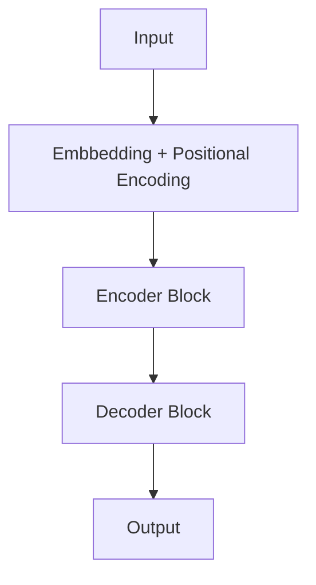

Large Language Models (LLMs) are advanced AI systems built on deep neural networks designed to process, understand and generate human-like text.

- LLMs Learn patterns, grammar and context from text and can answer questions, write content, translate languages and many more.
- They use **massive datasets** and **billions of parameters**, LLMs have transformed the way humans interact with technology.

### **Working of Large Language Models

### Advantages:

- Can perform new tasks using zero-shot and few-shot learning without retraining
- Efficiently process and understand large amounts of text data
- Adapt easily to specific domains through fine-tuning
- Automate repetitive language-based tasks, reducing human effort
- Work effectively across multiple domains like healthcare, education and business

### Limitations:

- Require very high computational resources, making them expensive to train
- Training can take a long time, often weeks or months
- Depend on large amounts of high-quality and unbiased data
- Consume significant energy, contributing to environmental impact
- Can introduce bias and misinformation, raising ethical concerns
