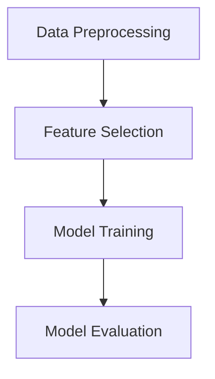

- It is a branch of Artificial Intelligence that focuses on **developing models** and **algorithms** that let computers learn from **data** without being explicitly **programmed for every task**.
- ML teaches systems to think and understand like humans by learning from the data.

### Basics:

### Types of ML:
#### 1. [[Supervised Learning]]:
- Trains models on labeled data to predict or classify new, unseen data.
#### 2. [[Unsupervised Learning]]:
- Finds patterns or groups in unlabeled data, like clustering or dimensionality reduction.
#### 3. [[Reinforcement Learning]]:
- Learns through trial and error to maximize rewards, ideal for decision-making tasks.
