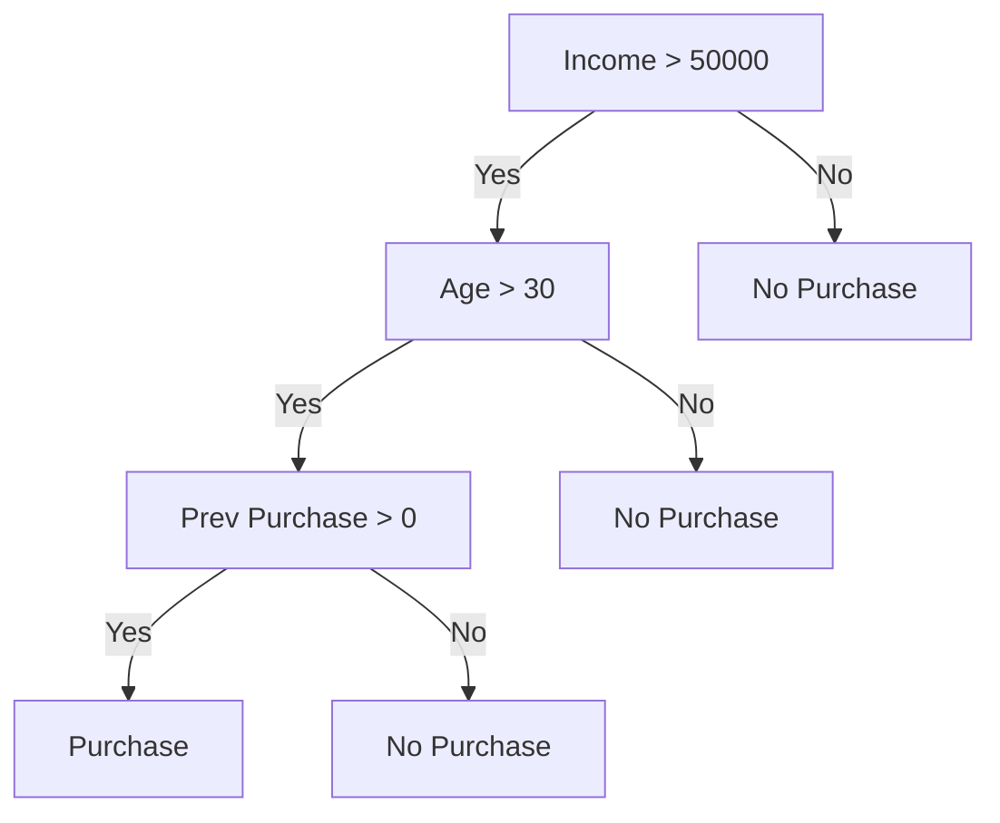

- It is a supervised learning algorithm used for both classification and regression tasks.
- It has a hierarchical tree structure which consists of a root node, branches, internal nodes and leaf nodes.
- It works like a flowchart that helps in making step-by-step decisions
- *ie*:
  1. Internal nodes represent attribute tests
  2. Branches represent attribute values
  3. Leaf nodes represent final decisions or predictions
- *eg*:

### Attribute Selection Measure of Decision Tree:
#### 1. Information Gain:
- It tells how useful a question (or feature) is for splitting data into groups
-  A good question will create clearer groups and the feature with the highest Information Gain is chosen to make the decision
#### 2. Gini Index:
- Equation
$$
Gini = 1 - \sum_{i=1}^{n} p_i^2
$$
- A lower Gini Index indicates a more homogeneous or pure distribution while a higher Gini Index indicates a more heterogeneous or impure distribution.
- Gini Index is used to evaluate the quality of a split by measuring the difference between the impurity of the parent node and the weighted impurity of the child nodes.
- Comparatively Gini Index is faster to compute and more sensitive to changes in class probabilities.
- One disadvantage of the Gini Index is that it tends to favour splits that create equally sized child nodes, even if they are not optimal for classification accuracy.
