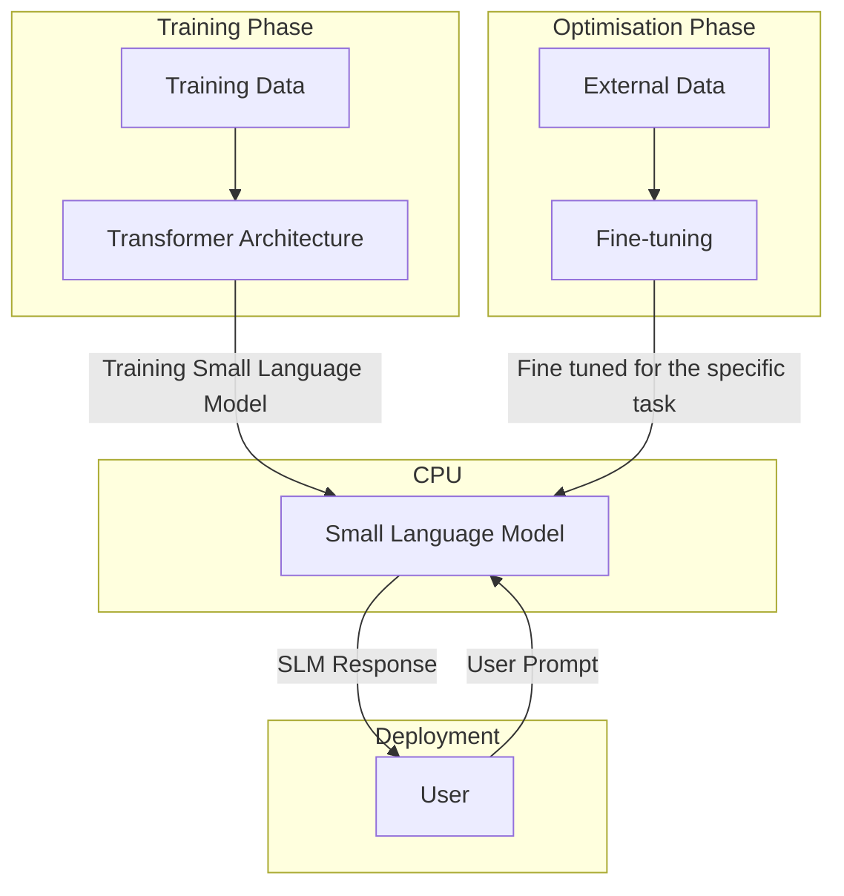

### **Statistical Language Models** (small language models)

- They are Natural Language Processing ([[NLP]]s) models with relatively fewer parameters compared to Large Language Models ([[LLM]]s) like GPT-4 or PaLM.

- They typically ranges form  millions to a few hundred million.

- These models are designed to be more resource-efficient while retaining decent language understanding and generation capabilities.

- SLMs are commonly used for domain-specific tasks in mobile apps, real-time systems, chatbots, and scenarios requiring privacy (on-device processing).

### **Features of SLMs**

1. Low computational and memory footprint
2. Faster inference and lower latency
3. Suitable for edge or on-device deployment
4. Easier to fine-tune for specific domains
5. Can operate under limited data conditions

### **Types of Small Language Models**

1. **[[Distilled Models]]**
2. **[[Quantized Models]]**
3. **[[Compressed Models]]**
4. **[[Domain-specific Miniature Models]]**

### **Working of Small Language Models**

